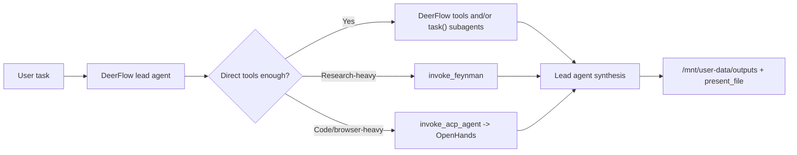

# OpenHands + Feynman Integration Solution Architecture

## Status

- Date: `2026-04-19`
- Status: proposed and ready to implement
- Scope: integrate `OpenHands` and `Feynman` into the current DeerFlow 2 runtime without replacing DeerFlow's orchestration model
- Low-level handoff spec: `docs/plans/2026-04-19-openhands-feynman-low-level-spec.md`

## Purpose

This document locks the architecture for integrating two specialist agent runtimes into this repository:

- `OpenHands` for code, browser, repo, and execution-heavy work
- `Feynman` for source-grounded research, literature review, compare/audit, and artifact-heavy synthesis

The target is not "call two more CLIs". The target is to let DeerFlow use them as delegated specialists while DeerFlow remains the planner, decomposer, and synthesizer.

## Current Repo Baseline

This design is anchored to the current DeerFlow 2 architecture in this repository.

- The lead agent is the primary orchestrator.
- Native parallel work already exists through `task()` subagents.
- External ACP agents already exist through `invoke_acp_agent`.
- Per-thread isolated ACP workspaces already exist under `backend/.deer-flow/threads/{thread_id}/acp-workspace/`.
- Lead/subagent work already uses `/mnt/user-data/{workspace,uploads,outputs}`.
- Custom agents already exist as `lead_agent + agent_name + SOUL.md`.
- MCP tools are already loaded into DeerFlow and are already forwarded into ACP sessions.

Relevant code paths:

- `backend/packages/harness/deerflow/tools/builtins/task_tool.py`
- `backend/packages/harness/deerflow/tools/builtins/invoke_acp_agent_tool.py`
- `backend/packages/harness/deerflow/tools/tools.py`
- `backend/packages/harness/deerflow/agents/lead_agent/prompt.py`
- `backend/packages/harness/deerflow/config/paths.py`
- `backend/app/gateway/services.py`
- `frontend/src/core/threads/hooks.ts`

## Problem Framing

OpenHands and Feynman do not fit the same integration contract.

- OpenHands has official ACP support. DeerFlow already has an ACP execution surface.
- Feynman is a research-first CLI and skills bundle. Public upstream materials do not expose a stable ACP contract or a public server contract comparable to OpenHands ACP.

Trying to force both tools through one identical integration path would either:

- underuse OpenHands by ignoring the repo's ACP path, or
- overfit Feynman into a protocol it does not actually expose.

The architecture therefore needs asymmetric integration while still giving DeerFlow one coherent orchestration model.

## Design Goals

- Keep DeerFlow as the top-level orchestrator.
- Reuse existing DeerFlow 2 surfaces where they are already correct.
- Make OpenHands and Feynman first-class delegated specialists, not ad hoc bash calls.
- Preserve per-thread isolation and artifact traceability.
- Give the lead agent clear routing rules so it uses each runtime only when it adds real value.
- Support progress updates in the existing streaming model.
- Avoid a new standalone control plane or runtime-manager service inside this repo.

## Non-Goals

- Do not replace DeerFlow with OpenHands or Feynman as the primary orchestrator.
- Do not force Feynman through ACP.
- Do not make OpenHands directly edit DeerFlow's main workspace in V1.
- Do not treat Feynman "skills only" install as full runtime integration.
- Do not add a new distributed run manager service to this repo.

## Architecture Decision

### Decision 1: DeerFlow remains the orchestrator

DeerFlow keeps these responsibilities:

- task decomposition
- direct tool usage
- parallelization through `task()`
- deciding when to escalate to an external specialist runtime
- synthesizing final answers from runtime outputs
- copying/presenting user-facing artifacts

OpenHands and Feynman are delegated runtimes, not peer orchestrators.

### Decision 2: OpenHands integrates through the existing ACP path

`OpenHands` should integrate through the repo's existing `invoke_acp_agent` mechanism.

Why this is the correct V1 path:

- the repo already supports ACP agents in `config.yaml`
- DeerFlow already forwards enabled MCP servers into ACP sessions
- DeerFlow already provides per-thread ACP workspaces and read-only access back to the lead agent
- OpenHands officially supports `openhands acp`

What changes are still required:

- enhance `invoke_acp_agent` so DeerFlow can seed context files into the ACP workspace before launch
- standardize the OpenHands output contract so the lead agent knows where to find summaries, diffs, and artifacts
- emit dedicated runtime custom events instead of only returning final text

What stays intentionally true in V1:

- OpenHands works in its own workspace, not directly in `/mnt/user-data/workspace`
- OpenHands is best used for isolated coding/browser/debug work and patch production
- DeerFlow remains responsible for pulling selected outputs back into `/mnt/user-data/outputs`

### Decision 3: Feynman integrates as a DeerFlow-native CLI delegated runtime

`Feynman` should integrate as a new DeerFlow built-in tool backed by the host CLI, not through ACP.

Why this is the correct V1 path:

- public Feynman materials expose a CLI- and file-oriented contract
- Feynman writes artifacts to directories such as `outputs/`, `papers/`, and `notes/`
- DeerFlow already has a strong filesystem and artifact story
- a native DeerFlow tool gives better control than shelling out through generic `bash`

What this tool should do:

- create a per-run delegated work directory under DeerFlow workspace
- materialize a task brief and selected input files into that directory
- execute the `feynman` CLI with a constrained workflow set
- collect artifacts and provenance sidecars
- emit progress events
- return a concise summary plus normalized artifact locations

### Decision 4: Add a small shared delegated-runtime helper layer

Do not build a new service. Add a small helper layer inside the harness for common delegated-runtime mechanics:

- per-thread/per-run directory creation
- input-pack materialization
- status and manifest file writing
- artifact discovery
- custom event emission
- process timeout and cleanup helpers

This helper layer should back:

- enhanced ACP invocation for OpenHands
- new CLI invocation for Feynman

### Decision 5: Route by capability, not by brand

DeerFlow should not "prefer OpenHands" or "prefer Feynman" blindly.

Routing should be based on task shape:

| Task shape | Best surface |
| --- | --- |
| quick search/fetch/read/write/bash inside DeerFlow sandbox | direct DeerFlow tools |
| parallel bounded investigation | `task()` subagents |
| evidence-heavy research, literature review, compare, audit, cited brief generation | `Feynman` |
| code execution, repo reasoning, patch generation, browser-heavy debugging | `OpenHands` |
| final answer, reconciliation across branches, artifact delivery | DeerFlow lead agent |

## Runtime Roles

### DeerFlow lead agent

The lead agent is responsible for:

- deciding whether direct tools are enough
- deciding whether the task should be delegated to a subagent
- deciding whether a specialist runtime is worth the overhead
- reading delegated outputs back into the main flow
- presenting the final answer

### Native DeerFlow subagents

Subagents are still the primary parallelization primitive.

They should remain the way DeerFlow:

- explores branches in parallel
- isolates verbose reasoning
- performs multiple bounded runtime invocations without overloading the lead context

Because subagents inherit the toolset except `task`, they will also be able to call the new Feynman tool and the ACP tool when appropriate.

### OpenHands

OpenHands should be treated as:

- a specialist coding/runtime executor
- a patch- or artifact-producing delegate
- an escalation path for tasks where DeerFlow's own direct tools are not enough

OpenHands should not be the default path for simple local edits because DeerFlow already has direct file and bash tools inside its own sandbox.

### Feynman

Feynman should be treated as:

- a research specialist
- a provenance-oriented delegated runtime
- the default escalation path for source-heavy research branches that exceed normal DeerFlow tool use

## Workspace Strategy

The two runtimes need different workspace models.

| Runtime | Workspace model | Why |
| --- | --- | --- |
| OpenHands | per-thread ACP workspace at `/mnt/acp-workspace`, with per-run DeerFlow outputs under `/mnt/acp-workspace/deerflow/{run_id}/` | already implemented, isolates external coding runtime while preventing parallel delegated runs from sharing output files |
| Feynman | per-run delegated directory under `/mnt/user-data/workspace/.delegated/feynman/<run-id>-<slug>/` | keeps research artifacts directly visible to DeerFlow without adding a new virtual mount |

### OpenHands workspace contract

OpenHands V1 should receive:

- an ACP work directory
- optional seeded `inputs/{run_id}/`
- a standard DeerFlow task brief

OpenHands should be instructed to write deterministic outputs such as:

- `deerflow/{run_id}/summary.md`
- `deerflow/{run_id}/artifacts.json`
- `deerflow/{run_id}/patch.diff` when code changes are proposed
- `deerflow/{run_id}/screenshots/` when browser work matters

### Feynman workspace contract

Each Feynman run should use a dedicated run directory:

```text
/mnt/user-data/workspace/.delegated/feynman/<run-id>-<slug>/
├── task.md
├── context/
├── outputs/
├── papers/
├── notes/
├── deerflow-result.json
└── deerflow-log.txt
```

This keeps Feynman's native file-based workflow intact while staying within DeerFlow's existing sandbox-visible workspace.

## Standard Delegated Runtime Contract

Regardless of runtime, DeerFlow should normalize each delegated run around the same minimal contract:

- a task brief
- a stable run directory
- a human-readable summary artifact
- a machine-readable manifest
- progress events during execution

Minimum manifest shape:

```json
{
  "runtime": "openhands | feynman",
  "run_id": "string",
  "status": "completed | failed | timed_out | cancelled",
  "summary_path": "string",
  "artifact_paths": ["string"],
  "error": null
}
```

This contract is internal to DeerFlow. It does not depend on either vendor's wire format.

## Event Model

DeerFlow should extend its current custom-event stream with delegated-runtime events.

Recommended event types:

- `delegated_runtime_started`
- `delegated_runtime_progress`
- `delegated_runtime_completed`
- `delegated_runtime_failed`

Minimum event payload:

```json
{
  "type": "delegated_runtime_progress",
  "runtime": "feynman",
  "run_id": "rtm_123",
  "description": "Literature review on RLHF alternatives",
  "message": "Collecting paper sources"
}
```

These events should be renderable in the same frontend status area currently used for subtask progress.

## Agent-Layer Integration

### Primary integration surface

The standard lead agent should become aware of both runtimes through:

- updated system prompt guidance
- an explicit runtime-routing skill
- tool descriptions that clearly state when each runtime is appropriate

### Optional packaging surface

Custom agents can still be used as product packaging, for example:

- `research-pro`
- `implementation-pro`
- `hybrid-operator`

But custom agents should not be relied on for hard runtime isolation in V1 because built-in tools remain globally available unless the harness grows a stronger per-agent tool allowlist for built-ins.

## Target End-to-End Flow



## Rejected Alternatives

### Do not force both runtimes through ACP

Rejected because OpenHands supports ACP, Feynman does not.

### Do not use Feynman "skills only" as the integration answer

Rejected because skills-only installs prompts and skills, not the runtime, task execution, artifact collection, or process lifecycle.

### Do not use generic `bash` as the primary integration path

Rejected because:

- it gives poor routing semantics to the model
- it has no normalized manifest contract
- it makes progress and artifact handling brittle

### Do not build a new runtime-manager service in this repo

Rejected for V1 because DeerFlow 2 already has the right orchestration locus inside the harness and Gateway streaming path.

## References

- OpenHands ACP docs: <https://docs.openhands.dev/openhands/usage/run-openhands/acp>
- OpenHands headless docs: <https://docs.openhands.dev/openhands/usage/how-to/headless-mode>
- OpenHands command reference: <https://docs.openhands.dev/openhands/usage/cli/command-reference>
- OpenHands MCP settings: <https://docs.openhands.dev/openhands/usage/settings/mcp-settings>
- Feynman official site: <https://www.feynman.is/>
- Feynman README: <https://raw.githubusercontent.com/getcompanion-ai/feynman/main/README.md>
- Feynman AGENTS contract: <https://raw.githubusercontent.com/getcompanion-ai/feynman/main/AGENTS.md>
